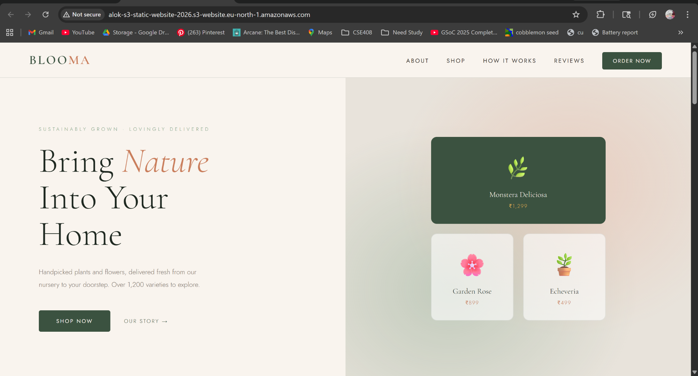
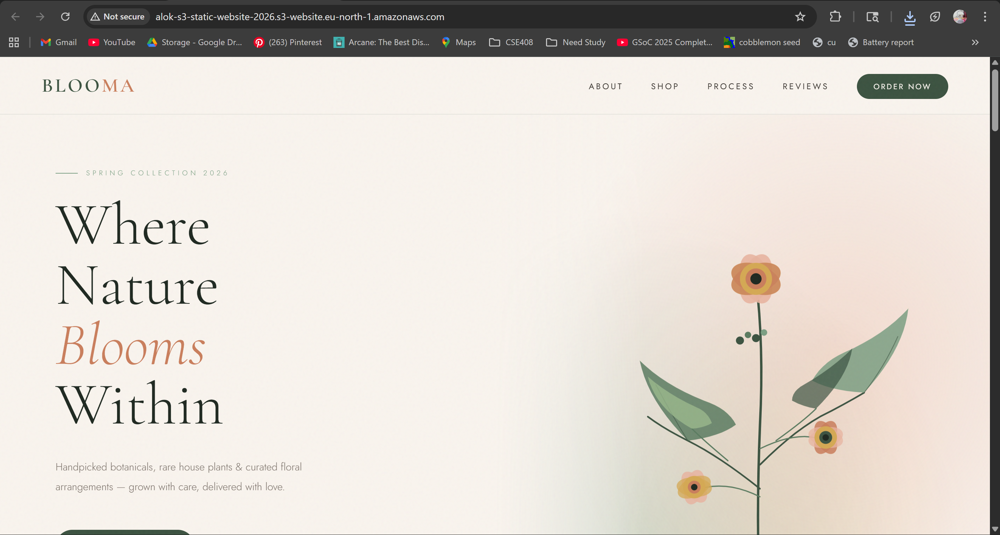
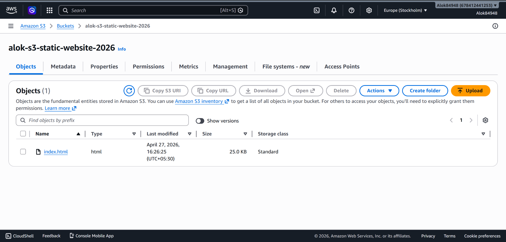
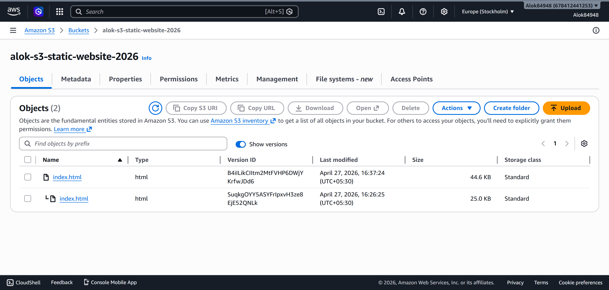
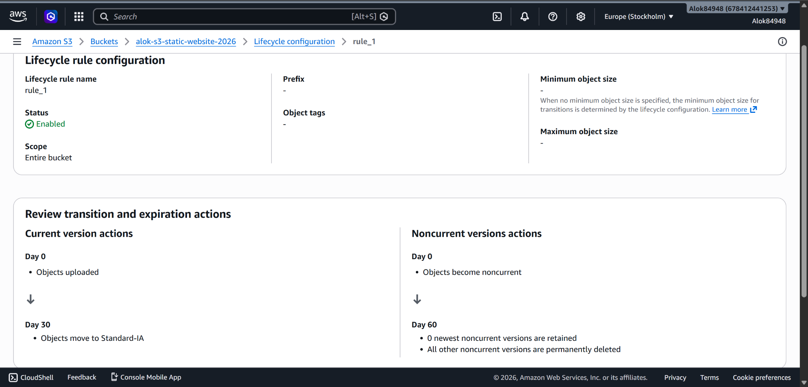

# AWS S3 Static Website Hosting with Versioning & Lifecycle Management

## 👤 Student Details

* **Name:** Alok Singh
* **Registration Number:** 12321124

---

## 🌐 Deployed Website Link

👉 http://alok-s3-static-website-2026.s3-website.eu-north-1.amazonaws.com

---

## 📌 Project Overview

This project demonstrates hosting a static website using Amazon S3 with:

* Static website hosting
* Version control using S3 Versioning
* Cost optimization using Lifecycle rules

---

## ⚙️ Steps Performed

### 1️⃣ S3 Bucket Creation

* Created a globally unique bucket:
  `alok-s3-static-website-2026`
* Uploaded website files

---

### 2️⃣ Static Website Hosting

* Enabled static hosting
* Set index document: `index.html`
* Successfully accessed website via S3 URL

---

### 3️⃣ Versioning

* Enabled versioning
* Uploaded:

  * Initial version (v1)
  * Updated version (v2)
* Verified multiple versions in S3

---

### 4️⃣ Lifecycle Rules

* Transition objects → Standard-IA after 30 days
* Delete old versions → after 60 days

---

## 📸 Screenshots

### 🔹 Static Website (Version 1)

---

### 🔹 Static Website (Updated Version)

---

### 🔹 S3 Bucket (Objects View)

---

### 🔹 Versioning (Multiple Versions)

---

### 🔹 Lifecycle Configuration

---

## ⚠️ Challenges Faced

* Configuring public access correctly
* Understanding versioning behavior
* Setting lifecycle rules without affecting current version

---

## ✅ Conclusion

This assignment helped in understanding:

* S3 object storage
* Static website hosting without servers
* Version control in cloud storage
* Cost optimization using lifecycle policies

---

## 💰 Cost Optimization Note

* Only S3 used → extremely low cost
* No EC2 / Elastic IP → zero compute charges
* Lifecycle rules reduce long-term storage cost

---
